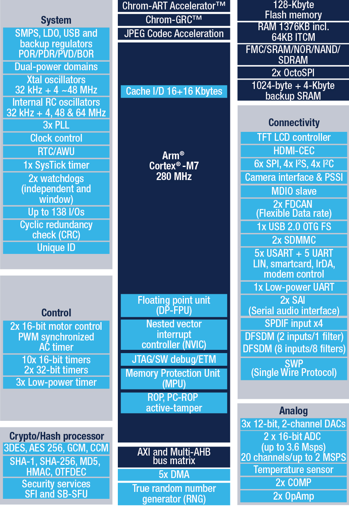

# [STM32H7B0](https://github.com/SoCXin/STM32H7B0)

* [ST](https://www.st.com/zh/): [Cortex-M7](https://github.com/SoCXin/Cortex)
* [L6R5](https://github.com/SoCXin/Level): 280 MHz (1414 CoreMark,599 DMIPS)

## [简介](https://github.com/SoCXin/STM32H7B0/wiki)

### 关键特性

* Cortex-M7 550 MHz 封顶
* 564KB RAM,128KB flash
* OctoSPI
* Ethernet
* USB OTG HS
* Octo-SPI外部串行闪存上实时解密

#### 相对短板

* 主频较低
* 没有以太网

### [资源收录](https://github.com/SoCXin)

* [参考资源](src/)
* [参考文档](docs/)
* [参考工程](project/)
* [入门教程](https://docs.soc.xin/STM32H7B0)

### [选型建议](https://github.com/SoCXin)

[STM32H7B0](https://github.com/SoCXin/STM32H7B0)

### [探索芯世界 www.SoC.xin](http://www.SoC.Xin)
